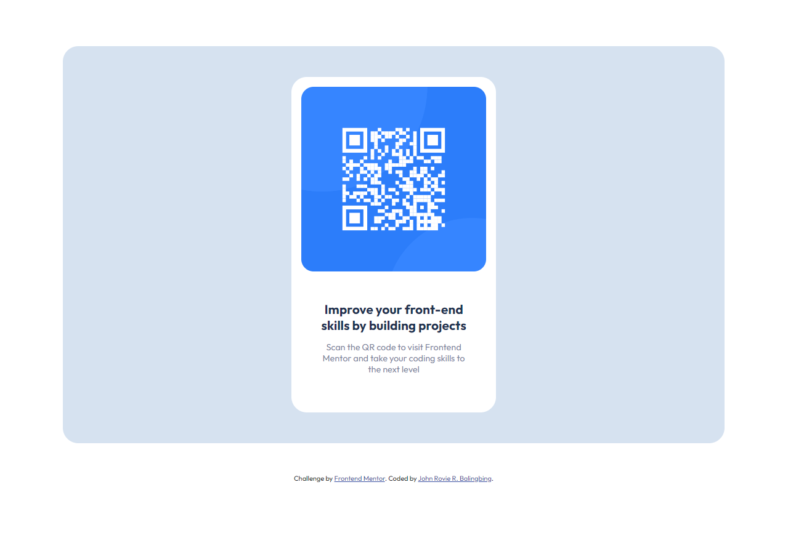

# Frontend Mentor - QR code component solution

This is a solution to the [QR code component challenge on Frontend Mentor](https://www.frontendmentor.io/challenges/qr-code-component-iux_sIO_H). Frontend Mentor challenges help you improve your coding skills by building realistic projects. 

## Table of contents

- [Frontend Mentor - QR code component solution](#frontend-mentor---qr-code-component-solution)
  - [Table of contents](#table-of-contents)
  - [Overview](#overview)
    - [Screenshot](#screenshot)
    - [Links](#links)
  - [My process](#my-process)
    - [Built with](#built-with)
    - [What I learned](#what-i-learned)
  - [Author](#author)
  - [Acknowledgments](#acknowledgments)

**Note: Delete this note and update the table of contents based on what sections you keep.**

## Overview

### Screenshot



### Links

- Solution URL: [https://github.com/rovicbalingbing/qrcode-frontendMentor.git](https://github.com/rovicbalingbing/qrcode-frontendMentor.git)
- Live Site URL: [https://rovicbalingbing.github.io/qrcode-frontendMentor/](https://rovicbalingbing.github.io/qrcode-frontendMentor/)

## My process

### Built with

- Semantic HTML5 markup
- CSS custom properties
- Flexbox
- Media Query
- Google Fonts

### What I learned

In this challenge, I remember how hard the basics is. Even if it was just a fundamentals or basic syntax, it is really important to remember it all because sometimes, it might get hard for you to solve a problem just because you can't remember the right syntax of line of coded needed.

```html
<div class="container">
    <div class="wrapper">
      <div class="qrcode-holder">
        
        <div class="text">
          <h1>Improve your front-end skills by building projects</h1>
          <h3>Scan the QR code to visit Frontend Mentor and take your coding skills to the next level</h3>
        </div>
      </div>
    </div>
  </div>
```
```css
:root {
      --white: hsl(0, 0%, 100%);
      --light-gray: hsl(212, 45%, 89%);
      --grayish-blue: hsl(220, 15%, 55%);
      --dark-blue: hsl(218, 44%, 22%);
      --outfit: 'Outfit', sans-serif;
    }
```

If you want more help with writing markdown, we'd recommend checking out [The Markdown Guide](https://www.markdownguide.org/) to learn more.

## Author

- Website - [Rovic Balingbing](https://www.github.com/rovicbalingbing/)
- Frontend Mentor - [@rovicbalingbing](https://www.frontendmentor.io/profile/rovicbalingbing)
- Twitter - [@roscidDreaming](https://www.twitter.com/roscidDreaming)


## Acknowledgments

I just want to thank  [Coder Coder](https://www.youtube.com/@TheCoderCoder) from YT for recommending this Frontend Mentor as a source of front-end web development ideas.